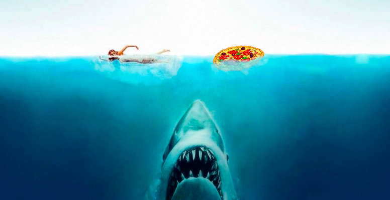

#

>## **GLOBAL SHARK ATTACKS ANALYSIS**

#####  
# 

>### **GOAL**

#### The goal is to clean and analyze this [DataFrame](https://www.kaggle.com/teajay/global-shark-attacks) containing recorded shark attacks.
#### To do this in the best possible way;
- #### Define some hypotheses that will help me focus on the objective.
- #### Clean the dataset acordingly.
- #### Display some interactive data visualization that will help me to contrast them.
#

>### **HYPOTHESES**

#### 1. Highest % of attacks occurs during **morning & afternoon**
#### 2. The highest number of attacks in activities occues by **Surfing**
#### 3. **White Shark** has the highest mortality 
#### 4. **Australia** has the higher number of attacks

#

>### **DATA VISUALIZATION & CONCLUSIONS**
#### 1. Highest % of attacks occurs during **morning & afternoon**

- #### Actually, the highest amount of attacks are during "Noon", then "Afternoon & then "Morning"
- #### The highest % of fatality is during "Night" 
- #### % Fatality (Afternoon 15% | Noon 18% | Sunrise 17% | Morning 16% | Evening 26% | Night 39%)
#
#### 2. The highest number of attacks in activities occues by **Surfing**
- #### Correct, the activity with the highest number of attacks is doing Surf 
- #### But the highest % of fatality is when practicing swimming 
- #### % Fatality (Surfing 12% | Diving 34% | Fishing 15% | Swimming 37% | Boating 10%)
#
#### 3. **White Shark** has the highest mortality 
- #### Wrong
- #### Tiger shark owns the higher fatality ratio 
- #### % Fatality (Tiger 25% | White 22% | Bull 20%)
#
#### 4. **Australia** has the higher number of attacks
- #### WRONG
  - #### 1. USA            --> (2.228 Attacks)
  - #### 2. AUSTRALIA      --> (1.337 Attacks)
  - #### 3. SOUTH AFRICA   --> (579 Attacks)

